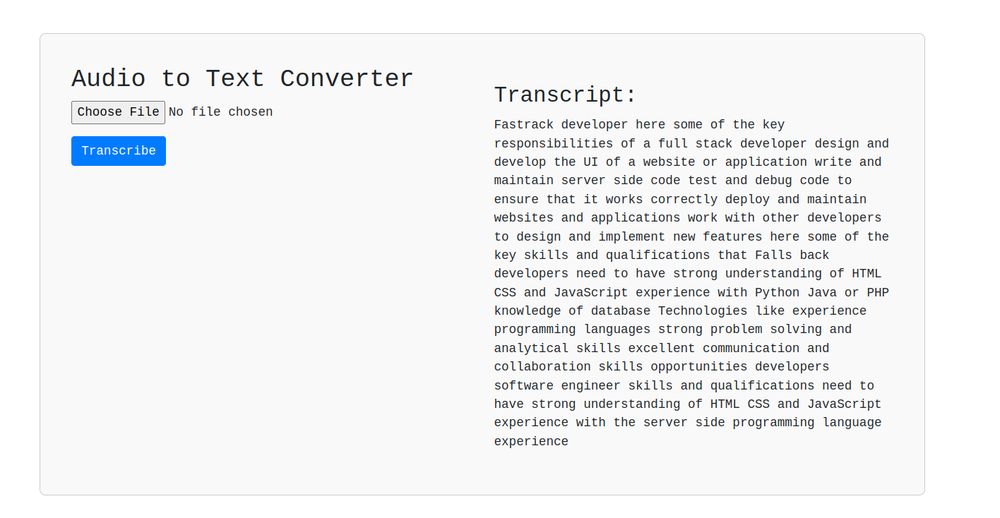

# Audio to Text Converter using Streamlit

This Python application allows users to convert audio files into text using the power of speech recognition. Built with Streamlit, it provides a simple interface for uploading WAV format audio files and transcribing them into text.

## Features

- **File Upload**: Upload a WAV format audio file.
- **Transcription**: Convert the uploaded audio file to text using SpeechRecognition library.
- **Display**: Provides the transcript of the audio file directly on the interface.

## Technologies Used

- **Streamlit**: Front-end framework for creating web applications with simple Python scripts.
- **SpeechRecognition**: Python library for performing speech recognition.

## Usage

1. Upload a WAV format audio file.
2. Click the "Transcribe" button to initiate the transcription process.
3. The transcript of the audio file will be displayed on the interface.

Feel free to use, modify, and enhance this tool for your audio-to-text conversion needs!
